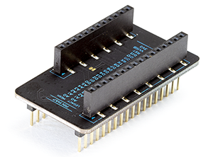

# Particle Classic Adapter
*Design files for the classic adapter to allow mesh devices to plug into Photon or Electron circuits*

The Particle Classic Adapter lets you use your Asset Tracker, Relay Shield, or other third-party shields with our third generation developer kits. Plug your Argon, Boron, or Xenon into this adapter and continue development as usual!

The top of the adapter has female connectors for you to plug in the Particle Mesh device. The bottom has male header pins in the Particle legacy form-factor for devices such as the Electron, Photon, or the Core.

The legacy side (male pins on the bottom) are designed to fit an Electron. So when plugging into a Photon socket please make sure the B/C pins side are hanging off the end, not plugged into anything.

You cannot supply more than 3.3V to any pin on the Argon/Boron/Xenon (except VUSB and the USB connector).

**Note:** This product is a one-way adapter. That is, this product does not enable use of Adafruit FeatherWings with the Photon or Electron.

### Pin Map

|Legacy Device | Mesh Device|
|:-------------|:-----------|
|A0 |A0 |
|A1 |A1 |
|A2 |A2 |
|A3 |A3 |
|A4 |A4 |
|A5 |A5 |
|D0 |D0 (SDA) |
|D1 |D1 (SCL) |
|D2 |D2 |
|D3 |D3 |
|D4 |D4 |
|D5 |D5 |
|D6 |D6 |
|D7 |D7 |
|C5[1]  |D8 |
|TX |TX |
|RX |RX |
|B5[1]  |D11 (MISO) |
|WKP[1]  |D12 (MOSI)|
|DAC[1]  |D13 (SCK) |
|RST |RST |
|VIN |VUSB |
|3V3 |3V3 |

**Notes:**

[1] These pins are connected via jumper pads on the top. You can cut these jumper traces and rewire them to a different pin on the Mesh device if the need arises.

[2] Pins C0 to C4 and B0 to B4 on the Particle legacy device headers are not connected to anything.

[3] Pins MD, Li+, and EN on the Particle Mesh device are not connected to anything.

### I2C

I2C (Wire) can be used on D0 and D1. However, pins on the mesh devices are not 5V tolerant, so make sure you do not have pull-ups to 5V.

### SPI

It's not possible to use SPI with the classic adapter. The mesh SPI pins (MISO, MOSI, SCK) are not connected to pins that support SPI on the Electron or Photon (B5, WKP, DAC). The mesh SPI1 pins overlap the Electron/Photon SPI1 pins, however they're different!

| SPI1 | Classic | Mesh | 
| --- | --- | --- |
| SCK | D4 | D2 |
| MOSI | D2 | D3 |
| MISO | D3 | D4 |

### Other Features

The mesh devices do not support DAC or CAN, so those classic devices using those features won't work with the classic adapter.